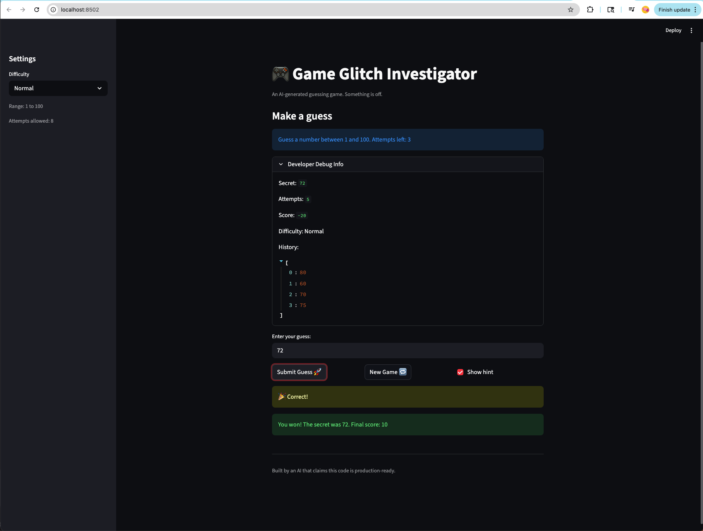

# 🎮 Game Glitch Investigator: The Impossible Guesser

## 🚨 The Situation

You asked an AI to build a simple "Number Guessing Game" using Streamlit.
It wrote the code, ran away, and now the game is unplayable.

- You can't win.
- The hints lie to you.
- The secret number seems to have commitment issues.

## 🛠️ Setup

1. Install dependencies: `pip install -r requirements.txt`
2. Run the broken app: `python -m streamlit run app.py`

## 🕵️‍♂️ Your Mission

1. **Play the game.** Open the "Developer Debug Info" tab in the app to see the secret number. Try to win.
2. **Find the State Bug.** Why does the secret number change every time you click "Submit"? Ask ChatGPT: _"How do I keep a variable from resetting in Streamlit when I click a button?"_
3. **Fix the Logic.** The hints ("Higher/Lower") are wrong. Fix them.
4. **Refactor & Test.** - Move the logic into `logic_utils.py`.
   - Run `pytest` in your terminal.
   - Keep fixing until all tests pass!

## 📝 Document Your Experience

- [ ] Describe the game's purpose.
      This is an AI-generated number guessing game where the player tries to guess a secret number within a limited number of attempts. The game provides hints after each guess to guide the player toward the correct answer, and awards points based on how quickly they guess correctly.
- [ ] Detail which bugs you found.
      Bug 1: The higher/lower hints were completely reversed — guessing too high showed "Go Higher" and guessing too low showed "Go Lower"
      Bug 2: The sidebar and game banner were out of sync — the banner always showed "Guess a number between 1 and 100" regardless of the selected difficulty
      Bug 3: The score incorrectly increased by 5 points on "Too High" guesses during even-numbered attempts instead of subtracting points
- [ ] Explain what fixes you applied.
      Bug 1: Corrected the swapped hint messages in check_guess in logic_utils.py so "Too High" returns "Go LOWER" and "Too Low" returns "Go HIGHER"
      Bug 3: Removed the incorrect even/odd attempt check in update_score in logic_utils.py so all wrong guesses consistently subtract 5 points
      Refactored all 4 core logic functions from app.py into logic_utils.py and updated app.py to import them

## 📸 Demo

- [ ] [Insert a screenshot of your fixed, winning game here]
      

## 🚀 Stretch Features

- [ ] [If you choose to complete Challenge 4, insert a screenshot of your Enhanced Game UI here]
